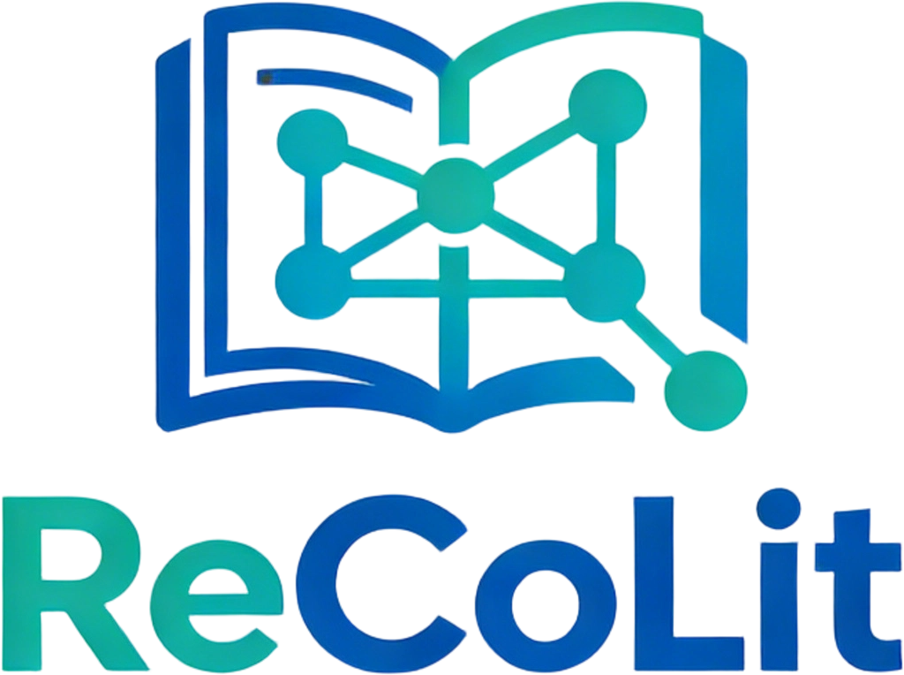

# ReCoLit
[English](README.md) |
[简体中文](README_zh_cn.md)
<p align="center">
    
</a>

ReCoLit is a one-stop literature management tool for team collaboration, dedicated to integrating the entire process of team literature sharing, reading, and knowledge base construction. 

It focuses on team collaboration scenarios, providing lightweight and highly efficient capabilities for document sharing, precise retrieval, and team knowledge base construction. It breaks down the barriers of internal document transmission, achieving centralized and standardized management of document resources, and significantly enhancing the efficiency of team document management. 

The product innovatively integrates professional cloud storage and transfer capabilities with academic literature reading and annotation functions:
- Supports secure storage, rapid sharing, and fine-grained permission control for team literature, enabling members to efficiently access the resources they need.
- Features core reading functions such as annotation, highlighting, and note-taking, eliminating the need to switch between multiple tools.
- Facilitates a one-stop process for literature acquisition → reading → annotation → management → collaboration, streamlining the entire workflow.
Significantly reduces the time and learning costs associated with team literature management.

## Get Started Quickly

Before anything else, you need to clone this project:
```bash
git clone https://github.com/lishuang996/ReCoLit.git
```

### Front-end
Before running the front end, please make sure you have the following software:
- `nodejs`

Enter the root directory of the front-end and then run `npm install` to install the dependencies: 
```bash
cd frontend
npm install
```

After the above tasks are completed, the front-end project can be run: 
```
npm run dev
```
You can now access the front-end page at [http://localhost:5173](http://localhost:5173)
